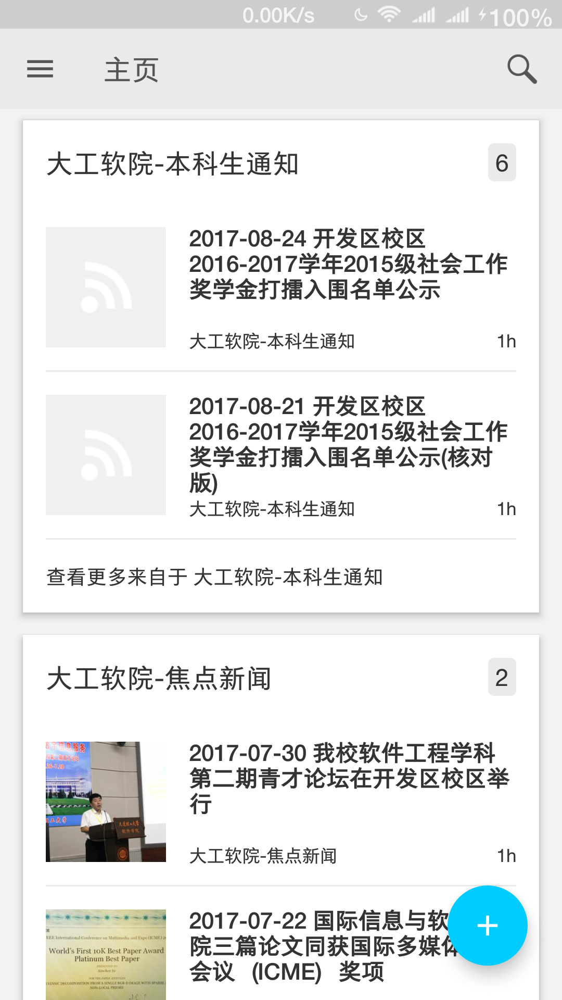

## 大连理工软件学院 新闻RSS源

### Why

以后，让各种软院公告、新闻自动通知我。

### 功能预览

一共有6个新闻源，不需要某个可自行退订。

##### 在浏览器中查看通知

###### 

##### 在手机中查看通知

### 安装指南

1.  安装RSS阅读器，这里以 Inoreader 为例：前往 [https://www.inoreader.com/](https://www.inoreader.com/) 注册账号

2.  下载并导入已经制作好的RSS源（OPML格式）

    2.1 右键另存为 [opml.xml](https://github.com/ShenHongFei/ssdut-news-feed/raw/master/opml.xml)

    2.2 在 Inoreader 中打开偏好设置 导入 opml.xml

3.  自行选择各种通知方式

    3.1 Chrome 浏览器通知 [https://chrome.google.com/webstore/detail/inoreader-companion/kfimphpokifbjgmjflanmfeppcjimgah](https://chrome.google.com/webstore/detail/inoreader-companion/kfimphpokifbjgmjflanmfeppcjimgah)

    ​	打不开的参考 [https://www.zhihu.com/question/53333703](https://www.zhihu.com/question/53333703)

    3.2 Android 手机通知

    ​	[https://apkpure.com/cn/inoreader-news-reader-rss/com.innologica.inoreader](https://apkpure.com/cn/inoreader-news-reader-rss/com.innologica.inoreader)

    3.3 iPhone 手机通知

    ​	[https://itunes.apple.com/app/inoreader-rss-news-reader/id892355414?mt=8](https://itunes.apple.com/app/inoreader-rss-news-reader/id892355414?mt=8)

### 原理

每隔一段时间抓取网页内容，根据已定义提取规则提取网页中内容，生成 RSS Feed。

RSS 阅读器每隔一段时间拉取RSS Feed内容并展示

关于如何定义提取规则，参考 [http://www.feed43.com/](http://www.feed43.com/)

### GitHub

[https://github.com/ShenHongFei/ssdut-news-feed/](https://github.com/ShenHongFei/ssdut-news-feed/)

欢迎贡献新的新闻源，欢迎 Star

### RSS Details

[http://www.feed43.com/zytg.xml](http://www.feed43.com/zytg.xml)

大工本部-教务重要通告

[http://www.feed43.com/xsdt.xml](http://www.feed43.com/xsdt.xml) 

大工软院-学术动态

[http://www.feed43.com/xytz.xml](http://www.feed43.com/xytz.xml) 

大工软院-学院通知

[http://www.feed43.com/bkstz.xml](http://www.feed43.com/bkstz.xml)

大工软院-本科生通知

[http://www.feed43.com/jdxw.xml](http://www.feed43.com/jdxw.xml) 

大工软院-焦点新闻

[http://www.feed43.com/xueyuanxinwen.xml](http://www.feed43.com/xueyuanxinwen.xml)

大工软院-综合新闻

### 授权

MIT License
